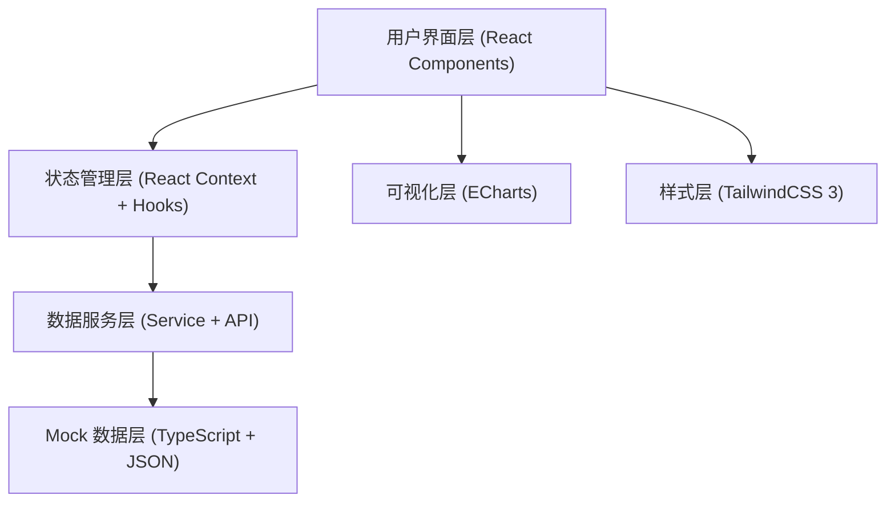
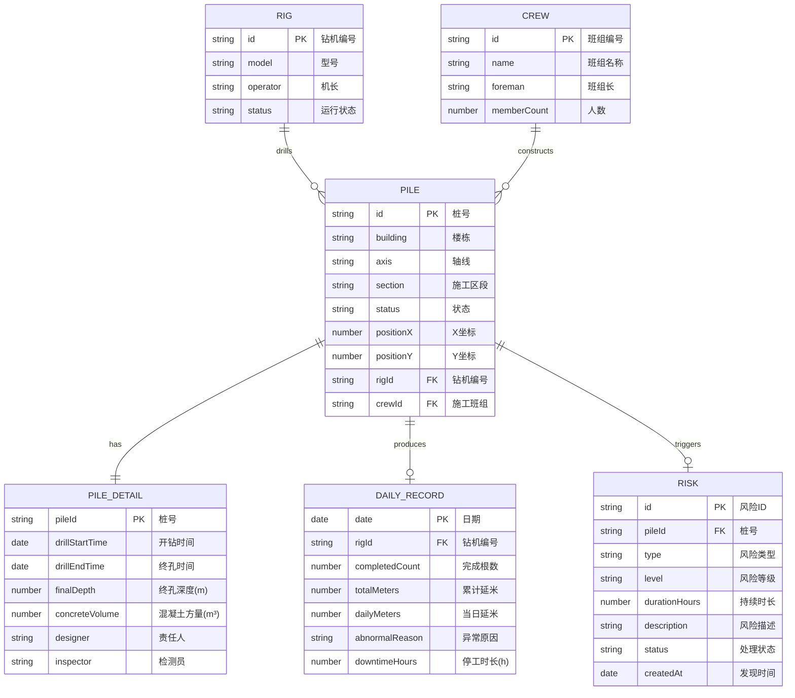

## 1. 架构设计

本项目为纯前端数据看板应用，采用分层架构设计，通过 Mock 数据模拟后端接口，确保前端功能完整可演示。



## 2. 技术描述

- **前端框架**: React 18 + TypeScript 5
- **构建工具**: Vite 5
- **样式方案**: TailwindCSS 3 + CSS Variables
- **图表库**: ECharts 5
- **路由管理**: React Router DOM 6
- **状态管理**: React Context + useReducer
- **图标库**: Lucide React
- **字体**: Google Fonts (Barlow Condensed, JetBrains Mono, Noto Sans SC)
- **开发工具**: ESLint + Prettier
- **数据来源**: 内置 Mock 数据（桩位数据、日报数据、风险数据）

## 3. 路由定义

| 路由路径 | 页面名称 | 说明 |
|---------|---------|------|
| `/` | 进度看板页 | 首页，展示桩位状态网格 |
| `/dashboard` | 进度看板页 | 同根路径，展示桩位状态 |
| `/daily` | 日报汇总页 | 产能统计、图表分析 |
| `/risks` | 风险提醒页 | 风险列表、置顶提示 |

## 4. 数据模型

### 4.1 数据实体关系



### 4.2 桩状态枚举

```typescript
enum PileStatus {
  NOT_STARTED = 'not_started',    // 未开工 - 灰色
  DRILLING = 'drilling',          // 成孔中 - 蓝色
  PENDING_POUR = 'pending_pour',  // 待灌注 - 橙色
  COMPLETED = 'completed',        // 已完成 - 绿色
  PENDING_TEST = 'pending_test'   // 待检测 - 紫色
}
```

### 4.3 风险类型枚举

```typescript
enum RiskType {
  NO_UPDATE = 'no_update',           // 连续未更新
  POUR_INTERVAL = 'pour_interval',   // 灌注间隔过长
  NO_TEST_RESULT = 'no_test_result'  // 检测结果未回填
}
```

## 5. 目录结构

```
src/
├── assets/                 # 静态资源
├── components/             # 公共组件
│   ├── Layout/            # 布局组件
│   ├── PileGrid/          # 桩位网格组件
│   ├── PileDetail/        # 桩详情弹窗
│   ├── StatCard/          # 指标卡片
│   ├── RiskCard/          # 风险卡片
│   └── FilterBar/         # 筛选栏
├── pages/                  # 页面组件
│   ├── Dashboard.tsx      # 进度看板页
│   ├── DailyReport.tsx    # 日报汇总页
│   └── RiskAlert.tsx      # 风险提醒页
├── data/                   # Mock 数据
│   ├── piles.ts           # 桩位数据
│   ├── dailyRecords.ts    # 日报数据
│   ├── rigs.ts            # 钻机数据
│   └── risks.ts           # 风险数据
├── types/                  # TypeScript 类型定义
│   └── index.ts
├── utils/                  # 工具函数
│   ├── statusColors.ts    # 状态颜色映射
│   └── dateUtils.ts       # 日期工具
├── context/                # 状态管理
│   └── AppContext.tsx
├── App.tsx                # 根组件
├── main.tsx               # 入口文件
└── index.css              # 全局样式 + Tailwind
```

## 6. 核心组件设计

### 6.1 PileGrid 组件

桩位网格核心组件，采用 CSS Grid 布局：
- 根据楼栋桩位图自动计算行列数
- 每个桩位为可交互单元格，支持 hover 和 click
- 根据状态渲染不同背景色
- 风险桩位添加呼吸灯动画效果
- 支持按楼栋、轴线、区段筛选重新渲染

### 6.2 状态颜色体系

```css
:root {
  --status-not-started: #6B7280;
  --status-drilling: #3B82F6;
  --status-pending-pour: #F59E0B;
  --status-completed: #10B981;
  --status-pending-test: #8B5CF6;
  --risk-highlight: #EF4444;
}
```

## 7. Mock 数据规模

- 桩位数据：3 栋楼 × 100 根 = 300 根桩
- 日报数据：近 30 天 × 8 台钻机 = 240 条记录
- 风险数据：10-15 条当前风险
- 钻机数据：8 台钻机
- 班组数据：4 个施工班组

